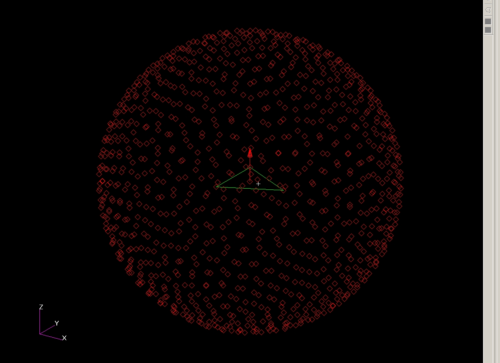
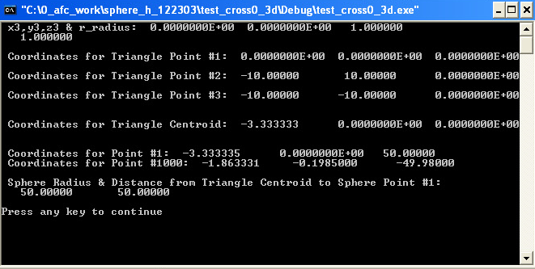

# ========================================
# Utility to Create (1000) Point Sphere Centered on NASTRAN FEM:
# ========================================

## Utility to Create (1000) Point Sphere Centered on NASTRAN FEM.

##
## I. (1000) Point Sphere Centered on NASTRAN Test FEM:

##
## II. Utility Executable: "./bin/test_cross0_3d.exe"

##
## III. Utility Input File: "./input/single_element_test_case.bdf"
    =================================
    START: "single_element_test_case.bdf"
    =================================
    GRID        1001           1.000     0.0     0.0
    GRID        1002          -1.000   1.000     0.0
    GRID        1003          -1.000  -1.000     0.0
    CTRIA3         1       1    1001    1002    1003     0.0     0.0
    =================================
    END: "single_element_test_case.bdf"
    =================================

##
## IV. Utility Output Files: "./output/output.bdf"
    =================================
    START: "output.bdf"
    =================================
    GRID        1001          10.000     0.0     0.0
    GRID        1002         -10.000  10.000     0.0
    GRID        1003         -10.000 -10.000     0.0
    GRID        1004          -3.333     0.0     0.0
    CTRIA3         1       1    1001    1002    1003     0.0     0.0
    GRID           1          -3.333     0.0  50.000
    CBAR           1       2    1004       1     0.0     0.0     0.0
    GRID           2           2.242  -1.006  49.680
    CBAR           2       2    1004       2     0.0     0.0     0.0
    ... CONTENT REMOVED ...
    GRID         998          -5.098  -4.464 -49.770
    CBAR         998       2    1004     998     0.0     0.0     0.0
    GRID         999          -5.320   4.109 -49.790
    CBAR         999       2    1004     999     0.0     0.0     0.0
    GRID        1000          -1.863  -0.198 -49.980
    CBAR        1000       2    1004    1000     0.0     0.0     0.0
    =================================
    END: "output.bdf"
    =================================
